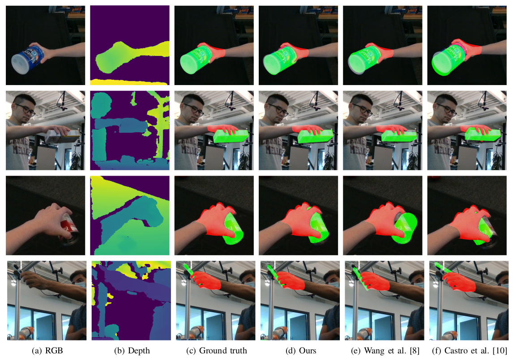

### Installation
numpy>=1.16.2 <br /> 
torchvision <br />
torch>=1.0.1.post2 <br />
chumpy <br />
trimesh <br />
pillow <br />
matplotlib <br />
opencv-python <br />

### Datasets  

* Download HO3D dataset [data](https://www.tugraz.at/institute/icg/research/team-lepetit/research-projects/hand-object-3d-pose-annotation/)
* Download DexYCB dataset [data](https://dex-ycb.github.io/)

```  
${ROOT}  
|-- data  
|   |-- HO3D
|   |   |-- data
|   |   |   |-- train
|   |   |   |   |-- ABF10
|   |   |   |   |-- ......
|   |   |   |-- evaluation
|   |   |   |-- train_segLable
|   |   |   |-- ho3d_train_data.json
|   |-- DEX_YCB
|   |   |-- data
|   |   |   |-- 20200709-subject-01
|   |   |   |-- ......
|   |   |   |-- object_render
|   |   |   |-- dex_ycb_s0_train_data.json
|   |   |   |-- dex_ycb_s0_test_data.json
```


### Train  
#### HO3d
```
sh sh/train_ho3d.sh
```
#### Dex-ycb
```
sh sh/train_dex-ycb.sh
```
### Test  
#### HO3d
```
sh sh/train_ho3d_test.sh
```
#### Dex-ycb
```
sh sh/train_dex-ycb_test.sh
``` 

### Qualitative Results.
